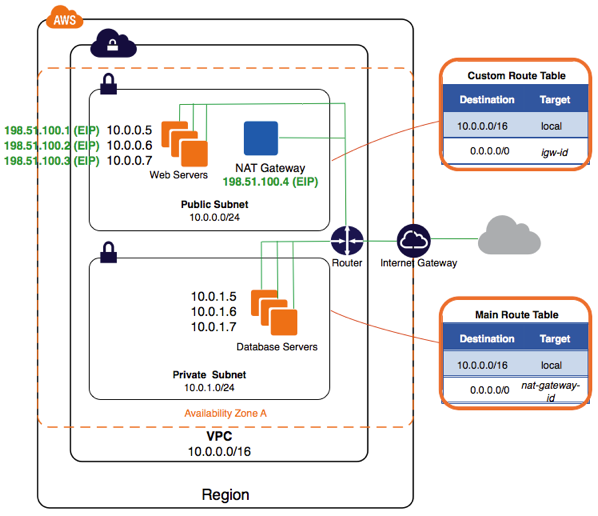
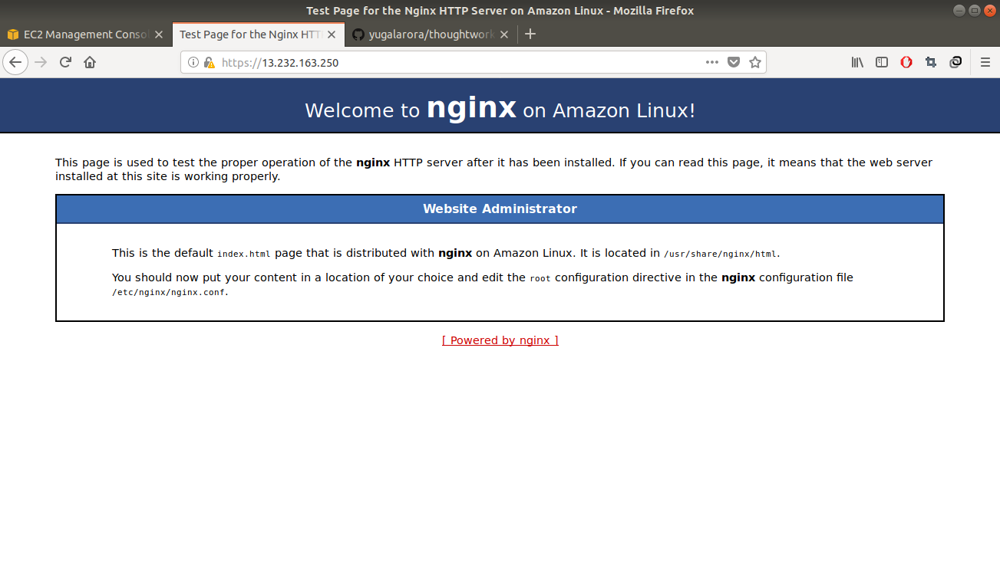
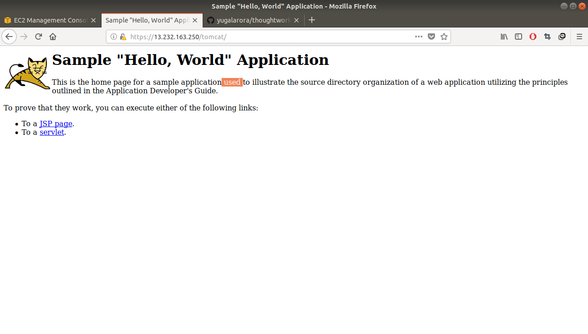

**Pre-requisites**

sudo pip install boto boto3 botocore ansible awscli

Note: you require an ubuntu or a linux system to run this playbook from

-------------------------------------------------------

***Steps to run playbook***

git clone https://github.com/yugalarora/thoughtworks.git

cd thoughtworks/ansible/

update your AWS Access key, Secret, IP Address in vars/main.yml

Bydefault, playbook will create a PEM file for you 'my_keypair.pem' in your AWS account, by reading contents of your ~/.ssh/id_rsa.pub

if you wish to send another public key, change the same in:
roles/provisioning/tasks/ec2.yml $LineNumber:6

ansible-playbook -i environment.hosts environment.yml

Next:-

Login to WebServer launched in public subnet (ssh ec2-user@{{ public_ip }})

run **sudo amazon-linux-extras install ansible2**

git clone https://github.com/yugalarora/thoughtworks.git

cd thoughtworks/ansible/

update private IP of AppServer in vars/main.yml
place private key (id_rsa) corresponding to publicKey used above here (roles/nginx/files/id_rsa)

ansible-playbook -i deployment.hosts deployment.yml

-------------------------------------------------------
A Detailed summary of what the playbook does:
***1) Environment provisioning:***

a) Create a VPC
b) Create a NAT Gateway
c) Attach EIP to NAT Gateway
d) Create 2 subnets (a Public/Weblayer and a Private/AppLayer)
e) Allow SSH from client to Server in Public subnet
**(This server will act as a web server for our Application and Also a bastion to reach servers inside AppSubnet)**
f) Allow SSH to servers in Private Subnet only from bastion
g) Allow/Restrict traffic between public and private subnet.

***2) Launch EC2 Servers:***

a) Launch a server in Public/AppLayer subnet, assign a public IP to it.
b) Launch a server in Private/Weblayer subnet

**Architectral view of Environment**

***3) Deployment***

a) Will copy your private key into bastion/WebServer
b) Install Nginx as a service on WebServer
c) Install certificate and ssl key in nginx
d) Push configuration file inside nginx
e) Validate nginx configuration and start the service
f) Install Tomcat as a service on AppServer
g) Deploy sample.war available on 'https://tomcat.apache.org/tomcat-7.0-doc/appdev/sample/sample.war'
 in Webapps directory
h) Start tomcat service.

**Snapshot of Nginx running on https**

**Snapshot of Tomcat running on https**

